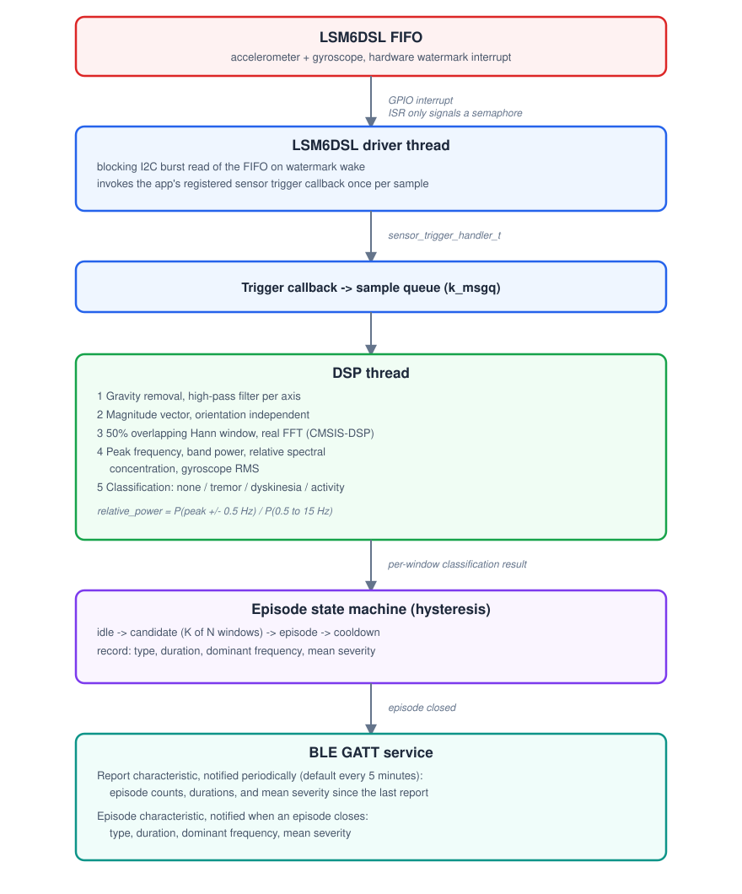

# Tremor and Dyskinesia Detection Wearable

A wrist worn embedded system built on Zephyr RTOS that detects Parkinsonian tremor and dyskinesia from a wrist mounted IMU, classifies movement episodes in real time on the device, and reports them over Bluetooth Low Energy.

## Problem statement

Parkinson's disease treatment is a balancing act. Dopamine therapy reduces tremor, a rhythmic oscillation typically in the 3 to 5 Hz range in a dominant limb. Too much dopamine causes dyskinesia instead, an involuntary, less rhythmic, dance like movement typically in the 5 to 7 Hz range. Clinicians need objective, continuous data on both symptoms to titrate medication correctly and keep a patient in the "on" state without tipping into dyskinesia.

This project builds a wearable that captures motion data from an onboard IMU, classifies it on device with a real time DSP pipeline, and reports tremor and dyskinesia activity over BLE as a periodic summary, the way a long term monitoring wearable should behave rather than a live data logger.

## Origin

The project started from a university embedded systems course assignment: detect tremor and dyskinesia from a single accelerometer and gyroscope on a development board, using Mbed OS and PlatformIO, an FFT over 3 second windows, and onboard indicators, with constraints such as no serial output and no additional hardware. That assignment is the origin of the idea, not the specification for this version.

Arm has since discontinued Mbed OS, so building further on the original platform was not a realistic option regardless of whether the classroom constraints still applied. That meant a full rewrite rather than an incremental port. This project moved to Zephyr RTOS, an actively maintained RTOS with its own build system, devicetree, and driver model, and rebuilt the system from the ground up as a production style embedded application, with custom driver development, RTOS level architecture, real time signal processing grounded in published methodology, and a BLE reporting protocol.

## Hardware

- Target board: ST B-L475E-IOT01A IoT Discovery Kit. STM32L475VG, Cortex-M4F at 80 MHz, 1 MB flash, 128 KB SRAM, hardware FPU.
- IMU: LSM6DSL 6 axis accelerometer and gyroscope on I2C, onboard hardware FIFO with a watermark interrupt wired to a GPIO. Both accelerometer and gyroscope are sampled.
- Bluetooth: SPBTLE-RF (BlueNRG-MS) module, HCI over SPI.
- Debug and flash probe: onboard ST-LINK/V2-1, SWD and virtual COM port.

Zephyr board name: `disco_l475_iot1`.

## System architecture



```
LSM6DSL FIFO (accel + gyro, watermark interrupt)
      |
      v   GPIO interrupt fires, ISR only signals a semaphore
driver's own acquisition thread
      |   blocking I2C burst read of the FIFO
      |   invokes the app's registered sensor trigger callback
      |   once per sample (gyro + accel already latched)
      v
app trigger callback -> sample queue (k_msgq)
      |
      v
DSP thread
      |   1. gravity removal (high pass filter per axis)
      |   2. magnitude vector, orientation independent
      |   3. 50% overlapping Hann window, real FFT (CMSIS-DSP)
      |   4. peak frequency (parabolic interpolation), band powers,
      |      relative spectral concentration, gyro RMS
      |   5. per window classification: none, tremor, dyskinesia,
      |      or activity (rejected)
      v
episode state machine (hysteresis)
      |   idle -> candidate (K of N windows) -> episode -> cooldown
      |   record: type, duration, dominant frequency, mean severity
      v
BLE GATT service
      episode characteristic: notified when an episode closes
      report characteristic: notified periodically (default every
      5 minutes) with episode counts, durations, and mean severity
      since the last report, not a live per window stream
```

The FIFO watermark interrupt handler does no I2C work, it only signals a semaphore. Zephyr's I2C transfer API is blocking and can only be called from thread context, so the driver's own dedicated thread does the actual burst read once it wakes up. This keeps the CPU idle between watermark events and avoids doing any bus work in interrupt context.

## Classification algorithm

Each analysis window is classified by spectral concentration rather than absolute power. For the dominant peak frequency in a window, the pipeline computes

```
relative_power = power(peak +/- 0.5 Hz) / power(0.5 to 15 Hz)
```

and classifies a window as active tremor or dyskinesia when this ratio clears a threshold. The intuition: genuine tremor or dyskinesia concentrates power around one frequency, while ordinary movement spreads power across a low frequency band and a higher "physiological tremor" band instead. This is scale invariant, unlike an absolute power threshold, so it is not sensitive to grip strength or how tightly the device is worn. The method and threshold are from published research, not invented from scratch, see References.

The 50 percent overlapping window choice is also grounded in published work on wearable tremor detection, see References.

Once a window is flagged as concentrated, which frequency band the peak falls in decides tremor versus dyskinesia, using the project's configurable band edges.

A second gate uses the gyroscope: genuine tremor barely rotates the wrist, while a deliberate voluntary motion at a similar frequency, such as a wave, involves much more net rotation. A window with excess gyroscope RMS energy is rejected as activity even if its accelerometer spectrum looked concentrated. This closes a real gap: accelerometer data alone cannot distinguish involuntary tremor from a voluntary gesture at the same frequency.

## Key design decisions

**Custom, out of tree LSM6DSL driver instead of Zephyr's built in one.** Writing the driver is a core goal of the project: devicetree bindings, Kconfig, the Zephyr driver model, and interrupt to thread handoff.

**FIFO plus watermark interrupt instead of per sample interrupts or polling.** The IMU batches samples in hardware, so the CPU wakes once per batch of samples instead of once per sample, which keeps the interrupt rate low and leaves room for low power operation later.

**Magnitude vector instead of full orientation fusion.** The magnitude of the acceleration vector is invariant to wrist rotation, which is enough for tremor and dyskinesia detection without a quaternion based orientation estimate. Orientation fusion is a stretch goal that would enable axis specific analysis, such as distinguishing rest tremor from postural tremor.

**Episode state machine with hysteresis instead of per window decisions.** A single noisy classification window is not a diagnosis. Requiring several consecutive positive windows to enter an episode, and a cooldown period to exit one, converts noisy per window output into stable episode records.

**Frequency bands are configurable through Kconfig rather than hardcoded.** The original classroom assignment used 3 to 5 Hz for tremor and 5 to 7 Hz for dyskinesia. Clinical literature describes a broader tremor range, roughly 3 to 9 Hz centered around 4 to 6 Hz, and describes dyskinesia as less rhythmic rather than simply higher frequency. Keeping the bands as build time configuration rather than hardcoded constants makes that discrepancy something to tune, not something baked in.

**BLE reports are periodic, not continuous.** A battery powered wearable should not hold a radio connection busy with a notification every second. The report characteristic aggregates episode counts, durations, and mean severity and sends one summary on a configurable interval, similar to how commercial tremor monitors such as the Parkinson's KinetiGraph report a periodic severity score rather than a continuous stream.

**Modularity and portability are treated as hard requirements.** Board specific and sensor specific details are kept behind devicetree, Kconfig, and a stable driver API, so switching to a different board or a different IMU part should mean changing configuration and swapping a driver, not rewriting the signal processing, state machine, or BLE application logic.

## BLE protocol

Device name: `Tremor Monitor`. One custom GATT service (UUID `c9a00000-1fdd-4a7e-9ab0-b1a9c0ab0001`) with two notify characteristics.

**Report characteristic** (`c9a00001-...`), notified periodically (`CONFIG_TREMOR_REPORT_INTERVAL_MIN`, default 5 minutes), 7 bytes little endian:

| Bytes | Field | Notes |
|---|---|---|
| 0 | tremor episode count | since the last report |
| 1 | dyskinesia episode count | since the last report |
| 2-3 | tremor duration | seconds, u16 |
| 4-5 | dyskinesia duration | seconds, u16 |
| 6 | mean severity | 0 to 100 |

**Episode characteristic** (`c9a00002-...`), notified when an episode closes, 6 bytes little endian:

| Bytes | Field | Notes |
|---|---|---|
| 0 | type | 1 = tremor, 2 = dyskinesia |
| 1-2 | duration | seconds, u16 |
| 3-4 | dominant frequency | deci-Hz, u16 |
| 5 | mean severity | 0 to 100 |

## Roadmap

1. Board bring up and boot sequence understanding.
2. Custom LSM6DSL driver: devicetree binding, FIFO and interrupt handling, interrupt to thread handoff.
3. DSP pipeline: windowing, FFT, feature extraction, classification, validation against known motion.
4. Episode state machine and a BLE GATT service for periodic reporting.

This is the full scope of the project. No firmware update mechanism is planned; the interesting parts of that problem (partition layout, signing, rollback) are a separate project on their own, not a natural extension of this one.

## Current status

- [x] Toolchain and board bring up, blink and log output confirmed
- [x] I2C communication with the LSM6DSL confirmed by reading the WHO_AM_I register
- [x] Custom LSM6DSL driver, FIFO watermark interrupt, gyroscope, confirmed on hardware
- [x] DSP pipeline and classification algorithm, confirmed on hardware
- [x] Episode state machine
- [x] BLE GATT service, periodic reporting, confirmed on hardware

## Building and flashing

This project uses the Zephyr RTOS build system: west, CMake, devicetree, and Kconfig.

Zephyr RTOS and its SDK must be installed first, with a west workspace set up. See the official [Zephyr Getting Started Guide](https://docs.zephyrproject.org/latest/develop/getting_started/index.html) ([zephyrproject.org](https://zephyrproject.org)). This project builds against that workspace, it does not vendor Zephyr itself.

```
west build -b disco_l475_iot1
west flash --runner openocd
```

## Repository layout

```
tremor_detection/
├── CMakeLists.txt
├── Kconfig                DSP pipeline and BLE report tunables
├── prj.conf
├── drivers/
│   └── lsm6dsl_custom/    out of tree LSM6DSL driver
├── src/
│   ├── main.c             acquisition glue, DSP thread, BLE report scheduling
│   ├── dsp/
│   │   └── pipeline.c     windowing, FFT, classification
│   ├── episode_fsm.c      hysteresis state machine
│   └── ble_service.c      GATT service
└── docs/                  reference material, datasheets, architecture diagram
```

## References

- Martinez et al., "Continuous Accelerometry-Based Tremor Detection During Daily Living," Sensors, 2026. https://doi.org/10.3390/s26051459
- San-Segundo et al., "Parkinson's Disease Tremor Detection in the Wild Using Wearable Accelerometers," Sensors, 2020. https://doi.org/10.3390/s20205817

## Note on using an RTOS

This project does not strictly need an RTOS. The sampling, DSP, and BLE work here could be done on bare metal or with a simpler scheduling approach. Zephyr RTOS was a deliberate choice, not a requirement of the problem. The tremor and dyskinesia detection problem itself was already familiar from the original class project, so this was a chance to learn Zephyr's driver model, devicetree, and RTOS architecture on a problem that did not also need to be learned from scratch.

## License

MIT. See `LICENSE`.
